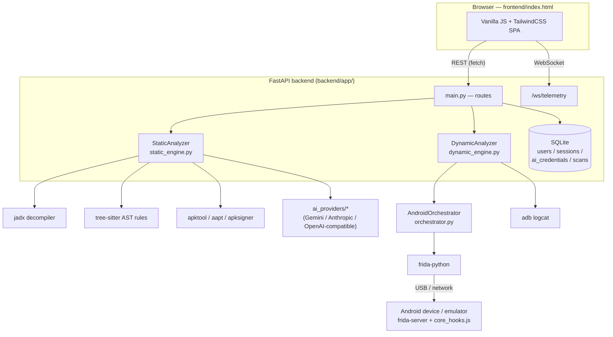

# Cerberus-ASF
Cerberus - Android Security Framework

**Automated Mobile Application Security Testing (MAST) platform for Android — static + dynamic analysis, AI-assisted triage, and live Frida instrumentation, behind one self-hosted dashboard.**

[](LICENSE)
[](https://www.python.org/)
[](https://fastapi.tiangolo.com/)
[](INSTALL.md)

Cerberus-ASF combines APK decompilation and structural code auditing with live, on-device Frida instrumentation, so you can go from "here's an APK" to a scored report, or from "here's a running app" to root/SSL-pinning bypass and RAM forensics, without stitching together five separate tools.

> ⚠️ **Authorized use only.** This tool is built for security researchers, penetration testers, and DevSecOps teams testing applications they own or are explicitly authorized to assess. Bypassing root detection, intercepting TLS traffic, or dumping process memory on an application without authorization may violate the law and the app's terms of service. You are responsible for how you use this tool.

---


## Contents

- [Why Cerberus-ASF](#why-cerberus-asf)
- [Features](#features)
- [Architecture](#architecture)
- [Tech stack](#tech-stack)
- [Quick start](#quick-start)
- [Usage](#usage)
- [API overview](#api-overview)
- [Configuration](#configuration)
- [Troubleshooting](#troubleshooting)
- [Security notes](#security-notes)
- [Project layout](#project-layout)
- [License](#license)

## Why Cerberus-ASF

- **One dashboard, two pipelines.** Static analysis (decompile, audit, score) and dynamic analysis (attach, hook, stream) live behind a single web UI backed by one FastAPI service — no separate agent app, no VM-only dynamic analyzer.
- **Self-hosted, no cloud dependency.** Everything — the server, the SQLite database, the decompiler, the Frida orchestration — runs on one host you control.
- **Multi-user, isolated.** Every account has its own scan history and its own AI provider credentials, encrypted independently at rest.
- **Real device, not a fixed VM image.** Connects to any USB device, network-adb device, or emulator running `frida-server` — no bespoke Android-x86 image to maintain.
- **Signal over noise.** Every finding and secret is tagged as belonging to the app's own code, a known third-party SDK, or unknown — so you can focus on what the app's developers actually shipped.
- **AI Deep Scan, opt-in.** Bring your own Gemini / Anthropic / OpenAI-compatible (Azure, OpenRouter, Groq, local Ollama, etc.) key to verify findings as true/false positives and catch logic-level bugs pattern matching can't.

## Features

**Static analysis**
- APK decompilation via `jadx`, with AST-based structural rules (tree-sitter) for weak crypto, SQL injection, insecure logging, insecure RNG, clipboard exposure, dynamic bytecode loading
- Manifest audit: exported components, `debuggable`, `allowBackup`, cleartext traffic, outdated `minSdkVersion`
- Certificate/signature analysis via `apksigner` — v1–v4 scheme detection, Janus vulnerability (CVE-2017-13156), debug-cert signing
- Multi-layer secret detection: AST field-secret queries, binary regex signatures (AWS/Google/Firebase/Stripe keys, JWTs), optional TruffleHog pass
- Framework/SDK identification (Flutter, React Native, Unity, Xamarin, Cordova, Firebase, RootBeer, and more)
- 0–100 weighted security score
- Optional AI Deep Scan: false-positive triage + semantic review of exported activities

**Dynamic analysis**
- Live Frida attach to a real device/emulator (USB, network adb, or remote)
- One-click root-detection bypass (`File.exists`, `Runtime.exec`/`ProcessBuilder`)
- One-click SSL pinning bypass (Conscrypt `TrustManagerImpl` + OkHttp3 `CertificatePinner`)
- Live RAM memory forensics for credential-shaped strings (API keys, JWTs, PEM blocks, passwords)
- Real-time telemetry and logcat streaming over WebSocket
- Automatic session teardown on disconnect — no orphaned instrumented processes

**Platform**
- Bearer-token auth with bcrypt password hashing, per-user data isolation
- AI provider keys encrypted at rest with Fernet, entered per-user through the UI (never via server env vars)
- Scan history persisted to SQLite, exportable executive-summary reports, ADB intent-fuzzing script generation

## Architecture



Full request-flow walkthroughs for both pipelines are in the [technical documentation](Cerberus-ASF_Technical_Documentation.docx).

## Tech stack

| Layer | Technology |
|---|---|
| Frontend | Vanilla JavaScript, HTML5, Tailwind CSS, native WebSocket API — single static file, no build step |
| Backend | Python 3.10+, FastAPI, Uvicorn (ASGI), Pydantic v2 |
| Static analysis | jadx, apktool, aapt/aapt2, apksigner, androguard, tree-sitter, TruffleHog (optional) |
| Dynamic analysis | Frida / frida-tools, frida-compile + frida-java-bridge (agent bundling), adb |
| AI integration | `google-genai`, `anthropic`, `openai` SDKs — per-user, opt-in |
| Data | SQLite (stdlib `sqlite3`, WAL mode, no ORM) |
| Reporting | `reportlab` — generates the exported PDF static analysis report |
| Security | bcrypt (passwords), Fernet / `cryptography` (AI key encryption at rest), bearer-token sessions |

## Quick start

Requires Ubuntu 22.04+ (or a recent Debian-based distro), a regular user with `sudo` access, and outbound internet during install.

```bash
git clone <this-repo-url> Cerberus-ASF
cd Cerberus-ASF
./install.sh   # do NOT run with sudo — it escalates internally where needed
./run.sh
```

Open `http://<server-ip>:8000`, register an account, log in, and (optionally) add an AI provider key under **AI Settings** to enable Deep Scan.

For manual installation, running as a systemd service, and full environment-variable reference, see **[INSTALL.md](INSTALL.md)**.

### Dynamic analysis device setup

Dynamic analysis needs a one-time setup on the Android device itself (separate from `install.sh`):

```bash
# 1. Root access is required on the device (Magisk works fine)
# 2. Match frida-server's version to the installed client:
backend/venv/bin/python3 -c "import frida; print(frida.__version__)"

# 3. Push and run a matching frida-server build
adb push frida-server-<version>-android-arm64 /data/local/tmp/frida-server
adb shell "su -c 'chmod 755 /data/local/tmp/frida-server; /data/local/tmp/frida-server -D'"
adb forward tcp:27042 tcp:27042

# 4. Confirm exactly one frida-server process is running
adb shell "su -c 'ps -A | grep frida-server'"
```

Full details, including why version matching and a single running instance both matter, are in [INSTALL.md § 9](INSTALL.md).

## Usage

**Static scan**
1. Log in, drop an APK onto the dashboard.
2. Optionally enable **Deep Scan** (requires an AI provider key under AI Settings) for false-positive triage and semantic findings.
3. Review the scored report: manifest issues, certificate audit, secrets, framework ID, component attack surface, and structural findings mapped to OWASP Mobile Top 10 categories.

**Dynamic scan**
1. Ensure `frida-server` is running on the target device (see above) and `adb devices` shows it.
2. Enter the target app's exact package name and click **Launch Pipeline**.
3. Toggle root-detection and/or SSL-pinning bypass as needed; watch live telemetry and logcat stream in.
4. Run a **Memory Scan** to sweep process RAM for plaintext secrets.
5. Click **Stop** to detach and compile the findings.

## API overview

All routes except registration/login require `Authorization: Bearer <token>`.

| Method | Path | Purpose |
|---|---|---|
| POST | `/api/auth/register` / `/api/auth/login` | Account creation / authentication |
| GET | `/api/auth/me` | Current user info |
| GET / POST | `/api/ai/credentials` | Read / save the caller's AI provider config |
| GET | `/api/scans` / `/api/scans/{id}` | Scan history |
| POST | `/api/static/upload` | Upload an APK for static analysis |
| POST | `/api/scan/start` / `/api/scan/stop` | Start / stop dynamic instrumentation |
| POST | `/api/scan/memory` | RAM memory forensics sweep |
| WS | `/ws/telemetry?token=...` | Live telemetry + logcat stream |
| POST | `/api/report/pdf` / `/api/report/fuzz` | Export a summary report / ADB fuzzing script |

Full reference in the [technical documentation](Cerberus-ASF_Technical_Documentation.docx).

## Configuration

All environment variables are optional — the app works out of the box with none set.

| Variable | Default | Purpose |
|---|---|---|
| `CERBERUS_DB_PATH` | `backend/app/cerberus-asf.db` | SQLite database location |
| `CERBERUS_SECRET_PATH` | `backend/app/.instance_secret` | Fernet key encrypting stored AI keys — treat like a password |
| `CERBERUS_JADX_TIMEOUT` | `600` | Max seconds for a single jadx decompile |
| `CERBERUS_MEMORY_SCAN_TIMEOUT` | `120` | Max seconds for a single memory forensics sweep |
| `CERBERUS_HOST` / `CERBERUS_PORT` | `0.0.0.0` / `8000` | Bind address/port (read by `run.sh`) |

There is **no AI API key environment variable** — provider credentials are entered per-user through the web UI and encrypted at rest.

## Troubleshooting

| Symptom | Fix |
|---|---|
| Static scans return far fewer findings than expected | `jadx` isn't installed/found — reinstall it, restart the server |
| Dynamic scan "succeeds" but no telemetry appears | The Frida agent wasn't built — `cd agent && ./build.sh` |
| Dynamic scan hangs with no error | More than one `frida-server` process on the device — kill all, start exactly one |
| "Unsigned" shown for a known-signed APK | `apksigner` isn't installed — `sudo apt install apksigner` |
| Can't see a USB device | Missing udev rule, or `adb` not installed |

Full troubleshooting guide with every known failure mode: [INSTALL.md § 12](INSTALL.md) and the [technical documentation](Cerberus-ASF_Technical_Documentation.docx).

## Security notes

- CORS is wide open and the server speaks plain HTTP by default — fine on a trusted private network, but put it behind a TLS-terminating reverse proxy before exposing it beyond that.
- Session tokens have no built-in expiry; logout is the only revocation path. This is a deliberate simplification for a self-hosted, single-operator tool, not a hardened multi-tenant design.
- Back up `CERBERUS_SECRET_PATH`'s file together with the database — without it, stored AI provider keys are permanently undecryptable.

See [INSTALL.md § 11](INSTALL.md) for the full list.


## License

MIT — see [LICENSE](LICENSE).
